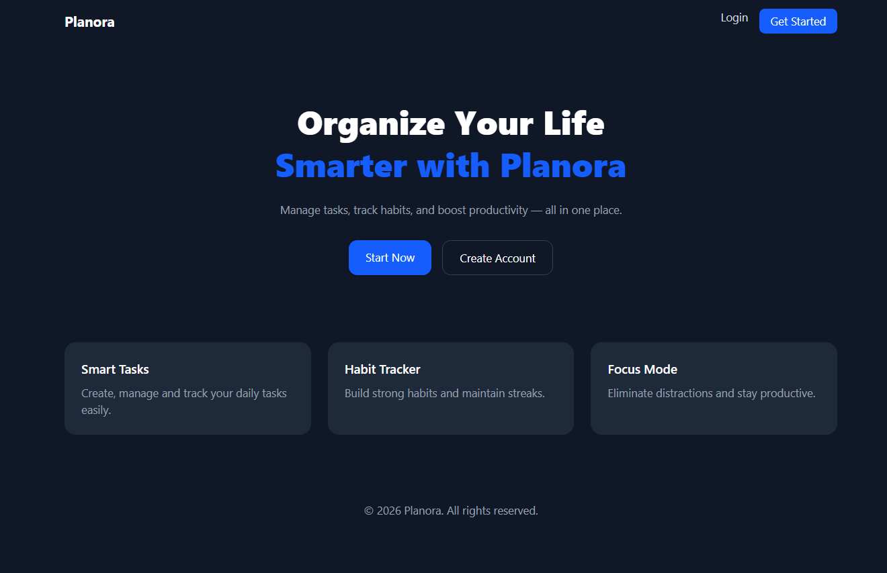
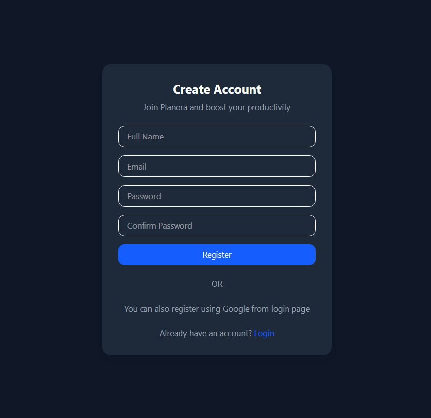
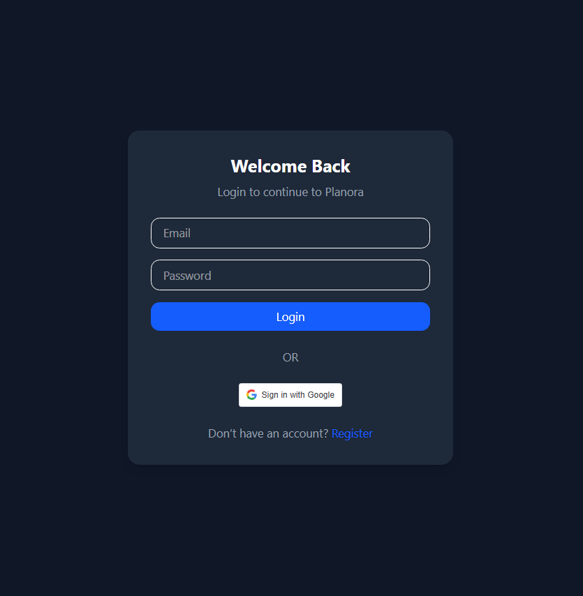
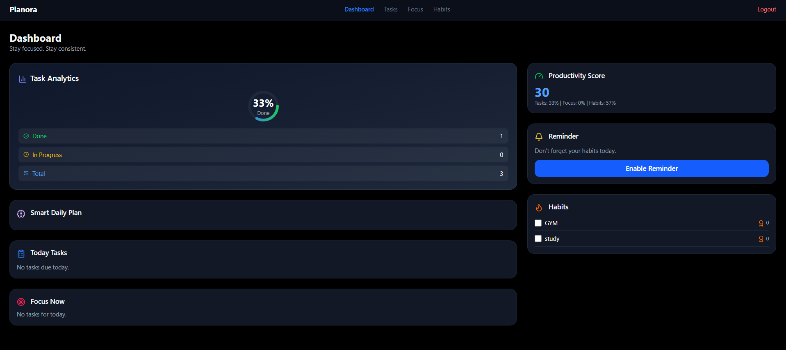
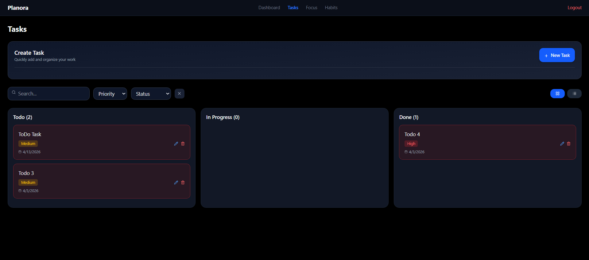
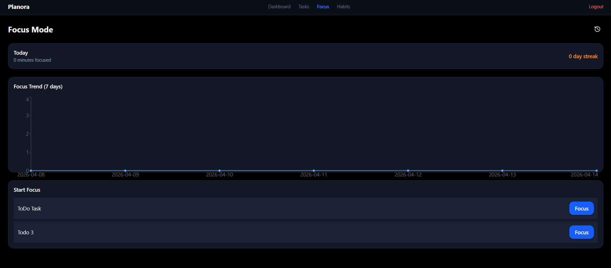
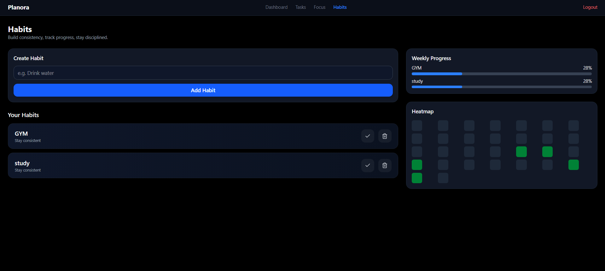

# Planora
Smart productivity web app built with Django &amp; React — task management, habit tracking, Kanban board, focus mode, and AI-powered planning.

Planora is designed to help users organize their workflow, build consistency, and boost productivity using modern UI/UX and scalable architecture.

---

## ✨ Features

### 🔐 Authentication

* JWT-based authentication (secure & scalable)
* User signup & login
* Protected API access
* Optional Google login support

### 📋 Task Management

* Full CRUD operations
* Priority levels (Low / Medium / High)
* Deadline & scheduling support
* Status tracking (Todo / In Progress / Done)

### 🗂 Kanban Board

* Drag & drop task system
* Smooth animations
* Real-time UI updates

### 🔁 Habit Tracker

* Daily habit tracking
* Streak system
* Weekly progress tracking
* Visual heatmap

### ⏱ Focus Mode

* Pomodoro-style timer
* Task-based focus sessions
* Productivity tracking

### 📊 Analytics Dashboard

* Task completion statistics
* Productivity score system
* Visual insights

### 🧠 Smart Planner

* AI-powered task suggestions *(planned)*
* Auto prioritization
* Daily workflow optimization

---

## 🧠 AI Features (Planned)

* Task prioritization using LLM
* Smart scheduling assistant
* Personalized productivity recommendations

---

## 🏗 Tech Stack

### Backend

* Django
* Django REST Framework
* JWT Authentication (SimpleJWT)
* PostgreSQL (Production) / SQLite (Development)

### Frontend

* React (Vite)
* Tailwind CSS
* React Query / Axios
* Drag & Drop (hello-pangea/dnd)

---

## 📸 Screenshots

### 🏠 Landing Page

<p align="center">
  
</p>

### 🔐 Authentication

<p align="center">
  
</p>

<p align="center">
  
</p>

### 📊 Dashboard

<p align="center">
  
</p>

### 📋 Task Management

<p align="center">
  
</p>

### ⏱ Focus Mode

<p align="center">
  
</p>

### 🔁 Habit Tracker

<p align="center">
  
</p>

---

## 📂 Project Structure

```bash
planora/
│
├── backend/
│   ├── apps/
│   │   ├── accounts/
│   │   ├── ai_engine/
│   │   ├── analytics/
│   │   ├── focus/
│   │   ├── tasks/
│   │   └── habits/
│   ├── config/
│   └── manage.py
│
├── frontend/
│   ├── src/
│   │   ├── components/
│   │   ├── pages/
│   │   ├── hooks/
│   │   └── api/
│   └── vite.config.js
│
└── README.md
```

---

## 📡 API Overview

### Auth

* `POST /api/auth/register/`
* `POST /api/auth/login/`

### Tasks

* `GET /api/tasks/`
* `POST /api/tasks/`
* `PUT /api/tasks/:id/`
* `DELETE /api/tasks/:id/`

### Habits

* `GET /api/habits/`
* `POST /api/habits/`

---

## 🎯 Future Improvements

* Real-time collaboration
* Notifications & reminders
* Mobile app (React Native)
* Advanced AI assistant
* Offline mode support

---

## 🧠 Why This Project Stands Out

* Full-stack production-ready architecture
* Clean UI with strong UX focus
* Combines multiple productivity systems into one platform
* Designed with scalability in mind (AI + background jobs ready)

---

## 🤝 Contributing

Contributions are welcome!

1. Fork the repository
2. Create a feature branch
3. Commit your changes
4. Open a pull request

---

## 📄 License

This project is licensed under the MIT License.

---

## 👨‍💻 Author

**Shantanu Kundu**
Full Stack Developer (Django + React)

---

## ⭐ Support

If you find this project useful, consider giving it a ⭐ on GitHub!
